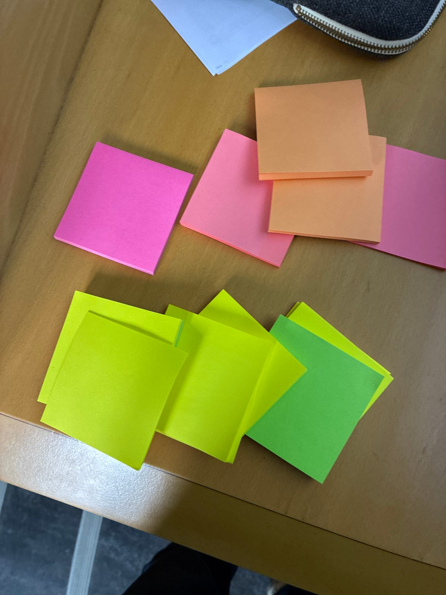

## Le rythme du tutoriel

::::::::: columns
:::: {.column width="33%"}
::: {.callout-note appearance="minimal"}
## My turn

Quelques slides pour poser les concepts clés.
:::
::::

:::: {.column width="33%"}
::: {.callout-tip appearance="minimal"}
## Our turn

Démo live — vous suivez dans votre éditeur.
:::
::::

:::: {.column width="33%"}
::: {.callout-warning appearance="minimal"}
## Your turn

Exercice en autonomie avec chronomètre.
:::
::::
:::::::::

::: notes
Expliquer le rythme dès le début. Chaque bloc suit ce cycle. L'idée c'est de passer un maximum de temps les mains dans le code, pas à regarder des slides.
:::

## Un atelier pour tous les niveaux

::: incremental
- **Exercices volontairement riches** — pas grave si vous ne finissez pas en séance : tout reste à reprendre après (ressources + paquet R compagnon)
- **Pas besoin d'écrire du R** — le cœur des exos, c'est Quarto / YAML / Typst ; le R des tableaux et graphes est déjà prêt dans les fichiers
- **Déjà à l'aise avec Quarto ?** — partez en **hors-piste** : explorez le bonus `brand.yml` côté R (déjà dans les starters / corrections), doc à l'appui
:::

::: notes
Annoncer dès le départ : tuto pensé pour **tous les niveaux**, le rythme My/Our/Your turn cale tout le monde. Trois messages : (1) les exos sont riches exprès — personne n'est censé tout boucler dans le chrono, le matériel reste à eux (site + paquet) pour rejouer après ; (2) débutant·es : on rassure, pas de R à écrire dans les étapes principales ; (3) avancé·es : on les invite explicitement à aller plus loin, hors-piste, vers le branding R (gt/ggplot) déjà présent dans les corrections, en s'aidant des docs — plutôt que d'attendre. ~45 s, ne pas s'attarder.
:::

## Le pad partagé de l'atelier

::::: columns
:::: {.column style="width:58%"}
Un **bloc-notes collaboratif** ouvert à toutes et tous — on y écrit ensemble, en direct.

- 🔗 Les **liens** de l'atelier (site, ressources, paquet R)
- ❓ **Vos questions** — posez-les ici, on y répond
- 📝 Vos **notes** et trouvailles à reprendre après

**Gardez-le ouvert** pendant les 2 h.
::::

:::: {.column style="width:42%; text-align:center"}
{width="62%" fig-alt="QR code menant au pad collaboratif Framapad de l'atelier."}

[annuel.framapad.org/p/quartorr-aluv](https://annuel.framapad.org/p/quartorr-aluv){target="_blank"}
::::
:::::

::: notes
À ouvrir tout de suite avec la salle — projeter l'URL/QR et laisser 30 s pour que chacun·e l'ouvre. C'est notre canal écrit partagé pour toute la durée : on y dépose les liens au fil de l'eau, les participant·es y posent leurs questions (Maëlle et CD y répondent, surtout les questions communes), et tout le monde repart avec les notes. Complémentaire des post-it (signal physique dans l'instant) : le pad, c'est l'écrit qui reste. Pensez à vérifier que le pad existe et est accessible avant la session.
:::

## Bloqué·e ? Fini ? Un post-it suffit

::::: columns
:::: {.column style="width:52%"}
{.illustration fig-alt="Photo de deux familles de post-it posés sur une table en bois : à gauche, des post-it roses et orange ; à droite, des post-it verts et jaunes."}
::::

:::: {.column style="width:48%"}
Pendant les exercices, **posez un post-it sur votre écran** — on vous repère d'un coup d'œil, pas besoin de lever la main.

- 🟧 **Rose / orange** — « je suis bloqué·e » → on passe vous voir
- 🟩 **Vert / jaune** — « c'est bon, j'ai fini ! »

::: {.fragment .fade-in}
👉 **En clôture**, on les recycle en feedback : un point qui vous a plu sur un **vert/jaune**, un point à améliorer sur un **rose/orange**.
:::
::::
:::::

::: notes
30 secondes, à montrer juste avant le premier exercice. Le but : un canal de signalement silencieux et lisible depuis le fond de la salle. **Rose/orange = appel à l'aide** (Maëlle passe dans les rangs, CD rebondit au tableau si la question est commune) ; **vert/jaune = terminé** (permet de jauger le rythme et d'aiguiller les rapides vers le hors-piste / bonus). Rappeler le double usage : en clôture, on rouvre les deux tas pour récolter un feedback express — positif sur vert/jaune, à améliorer sur rose/orange — à coller sur un mur ou à nous remettre. Cohérence des couleurs : vert/jaune = « ça va », rose/orange = « ça coince », dans les deux temps.
:::

## Code de conduite

Cet atelier s'inscrit dans le **code de conduite des Rencontres R 2026** — on s'engage à le faire respecter ici comme ailleurs.

L'esprit, en deux mots :

- Un environnement **bienveillant et sûr**, sans harcèlement, pour toutes et tous
- **Respect et bienveillance** dans le langage comme dans les échanges
- Un souci, une gêne ? **Parlez-nous** ou à un membre de l'orga (badge)

[Code de conduite complet des Rencontres R 2026](https://rr2026.sciencesconf.org/page/mentions_legales_chartes){target="_blank"}

::: notes
30 secondes, ton sérieux mais sans plomber l'ambiance. Le message clé : on ne fait pas un code à part, on s'inclut dans celui de la conf et on s'engage à le faire vivre dans la salle. Rappeler qu'on est deux (Maëlle passe dans les rangs) et joignables si quoi que ce soit. Pas besoin de lire la liste : donner l'esprit et le lien.
:::

## C'est quoi Typst ?

[Typst](https://typst.app/) joue le même rôle que LaTeX : produire un PDF. Avec Quarto, vous restez côté Markdown — il traduit vers Typst tout seul.

::: {.fragment}
Ce que **vous écrivez** (Markdown) :

``` markdown
# Mon rapport

Un mot **en gras**
et un [lien](https://example.org).
```
:::

::: {.fragment}
Ce que **Quarto génère** (Typst) :

``` typ
= Mon rapport

Un mot #strong[en gras]
et un #link("https://example.org")[lien].
```
:::

::: notes
Slide visuelle : le but n'est pas d'enseigner Typst, c'est de rassurer. "Tu écris du Markdown, t'as pas besoin d'apprendre Typst pour démarrer." Le snippet Typst montre la traduction concrète — `=` pour le titre, `#strong[...]` pour le gras, `#link(...)[...]` pour les liens.

Contrat oral : la slide suivante montre le pipeline (`.qmd → .typ → PDF`), et on ouvrira ensemble le vrai `.typ` un peu plus loin (`keep-typ: true`) — pas une option facultative. Le participant est prévenu, pas de surprise à l'Exo 1 étape 3.

On y jettera un œil ensemble avec `keep-typ: true` — juste pour démystifier.
:::

## Du `.qmd` au PDF

{width="100%" fig-alt="Pipeline en trois étapes : rapport.qmd (source) → Pandoc → rapport.typ (intermédiaire Typst) → Typst → rapport.pdf (sortie)."}

::: notes
Vue d'ensemble, posée juste après la traduction Markdown→Typst : où se place chaque pièce. Quarto (via Pandoc) traduit votre `.qmd` en `.typ`, puis Typst compile ce `.typ` en PDF. Ce `.typ` intermédiaire, on l'ouvrira concrètement un peu plus loin avec `keep-typ: true`.
:::

## `format: typst` — un PDF sans LaTeX

Vous avez un document Quarto et vous voulez un PDF ?

``` {.yaml filename="rapport.qmd"}
---
title: "Mon rapport"
format: typst
---
```

::: incremental
- **Rien à installer** — Typst est intégré à Quarto depuis la version 1.5
- **Rapide** — compilation en quelques secondes, pas plusieurs minutes
- **Erreurs lisibles** — fini les messages LaTeX cryptiques
- **Léger** — pas de distribution TeX de 1 Go à gérer
:::

::: notes
Le point d'entrée : une seule ligne de YAML. Pas besoin de convaincre les gens que LaTeX est mauvais — montrer directement que Typst est simple.
:::

## Les options de formats

``` {.yaml filename="rapport.qmd" code-line-numbers="3-5"}
---
format:
  typst:
    toc: true
    papersize: a4
    margin:
      x: 2.5cm
      y: 2.5cm
---
```

::: {.fragment .fade-in}
D'autres options existent (`mainfont`, `number-sections`, `linestretch`...) — on les verra en démo.
:::

::: notes
Ne pas tout montrer ici. Juste papersize et margin pour que les gens voient la structure YAML. Le reste sera manipulé en live.
:::

## `keep-typ: true` — comprendre les coulisses {footer=false}

Souvenez-vous du pipeline : le `.typ` intermédiaire, entre votre `.qmd` et le PDF. `keep-typ: true` le **conserve** sur le disque pour que vous puissiez l'ouvrir.

::: {.fragment .fade-in}
``` {.yaml filename="rapport.qmd" code-line-numbers="4"}
---
format:
  typst:
    keep-typ: true
---
```
:::

::: {.fragment .fade-in}
Le fichier `.typ` intermédiaire vous permet de :

- Comprendre ce que Quarto génère pour Typst
- Déboguer un rendu inattendu
- Apprendre la syntaxe Typst progressivement
:::

::: notes
Moment pédagogique clé. Le pipeline démystifie la magie : Quarto n'est pas une boîte noire, on peut voir ce qui se passe entre le .qmd et le .pdf.
:::

## `_brand.yml` — un doc stylé en un fichier

Un seul fichier YAML pour définir l'identité visuelle de vos documents :

::::::: columns
::: {.column width="45%"}
``` {.yaml filename="_brand.yml"}
color:
  primary: "#1a5276"
  secondary: "#f39c12"
typography:
  fonts:
    - family: "Noto Sans"
      source: google
  base: "Noto Sans"
```
:::

::: {.column width="5%"}
:::

:::: {.column width="45%"}
::: incremental
- Placez `_brand.yml` à côté de votre `.qmd`
- Quarto l'applique **automatiquement**
- Couleurs, polices, logo...
- Fonctionne avec HTML, Typst, RevealJS...
:::
::::
:::::::

## `_brand.yml` — un doc stylé en un fichier

::: {.center style="width:100%; margin:0 auto;"}
```{typst}
//| alt: "Schéma en étoile : au centre, le fichier _brand.yml ; des flèches partent vers cinq sorties qu'il stylise — PDF (Typst), Page web (HTML), Slides (RevealJS), Graphe ggplot2 et Tableau gt."
#import "@preview/fletcher:0.5.8" as fletcher: diagram, node, edge

#let blue = rgb("#2568B0")
#let gold = rgb("#c78d22")
#let ink  = rgb("#1a1a1a")
#let sans = ("Inter", "Helvetica Neue", "Arial", "Liberation Sans", "DejaVu Sans")
#let mono = ("Inter Mono", "Liberation Mono", "DejaVu Sans Mono")
#set text(font: sans, size: 13pt, fill: ink)

#let spokes = (
  ((0, -1.25),  "PDF (Typst)"),
  ((1.5, -0.4), "Page web (HTML)"),
  ((0.95, 1.2), "Tableau gt"),
  ((-0.95, 1.2),"Graphe ggplot2"),
  ((-1.5, -0.4),"Slides (RevealJS)"),
)

#diagram(
  spacing: (34mm, 22mm),
  ..spokes.map(((pos, lbl)) => edge((0,0), pos, "->", stroke: 1pt + gold.darken(5%))),
  ..spokes.map(((pos, lbl)) => node(pos, lbl, stroke: 0.8pt + blue, fill: blue.lighten(92%), corner-radius: 3pt, inset: 8pt)),
  node((0,0), text(font: mono, size: 13pt, fill: white, weight: "bold")[\_brand.yml], fill: gold.darken(5%), stroke: none, corner-radius: 4pt, inset: 11pt),
)
```
:::

::: notes
**Mention orale \~30 sec pendant la démo Our turn** : le `_brand.yml` ne pilote pas que le PDF. Le paquet R `brand.yml` fournit des helpers `theme_brand_ggplot2()` et `theme_brand_gt()` qui appliquent la même charte aux figures et tableaux. Visible dans `correction/rapport-starwars.qmd`. On en parle pas plus, c'est dans les Ressources.

Parler des helpers R `theme_brand_*()`.

(La Q&A sur le placement du logo — question d'étape 3 du Your turn — est dans `_speaker/demo-bloc1-our-turn.qmd`, section Pièges.)
:::

## Voici la charte {footer=false}

:::::: columns
::: {.column width="55%"}
{fig-alt="Page A4 de la charte graphique Star Wars : logo étoile jaune en haut-gauche, titre 'CHARTE GRAPHIQUE' en rouge impérial gras, sous-titre Saga Star Wars, 4 échantillons de couleur (rouge impérial, noir SW, crème, jaune SW) avec codes hexadécimaux, titres de section (Palette, Typographie, Logo) en Star Jedi rouge impérial, sections Typographie (Star Jedi locale, Inter Google) et Logo, pied de page méta."}
:::

::: {.column width="45%"}
::: incremental
- Une **vraie charte** à traduire
- Palette nommée + rôles (`primary`, `foreground`, `background`)
- Polices: Inter (Google) + Star Jedi (locale)
- Ce PDF est lui-même rendu par Quarto + Typst + `_brand.yml` — vous allez faire pareil
:::
:::
::::::

::: notes
Slide-pont entre le concept générique (`_brand.yml`) et la démo concrète. Le PDF est dans le starter de l'exercice — chaque apprenant·e l'ouvre côté lecteur PDF. **Côté Our turn et Your turn** : projeter `_charte/charte-starwars.pdf` à l'écran (ou via `1-quarto-typst/charte-starwars.png` si plus rapide) pour que l'apprenant·e voie cible et transcription en parallèle.

Méta-cohérence pédagogique à expliciter à l'oral : « ce PDF que vous tenez n'est pas qu'une spec, c'est un exemple rendu — son logo, ses titres en Star Jedi rouge, sa palette viennent d'un `_brand.yml` identique à celui que vous allez écrire ».

Le terme « rôles » dans nos supports correspond aux « assignments » de la charte (terme anglais conservé dans la spec `_brand.yml`) = mapping `primary` / `foreground` / `background` → noms de palette. Le préciser oralement (la charte n'a pas la place de l'expliquer).
:::

## Faisons ensemble !

::: callout-tip
## Faisons ensemble !

On passe le doc en PDF Typst, puis on lui applique une couleur via `_brand.yml`.

1.  Ouvrez `rapport-starwars.qmd` (dossier `01-document-typst/starter/`), passez `format: html` → `format: typst`, rendez → PDF brut
2.  Créez `_brand.yml` **dans le même dossier** (à côté du `.qmd`) avec **une seule couleur** + rôle `primary`, re-rendez → le lien de l'intro passe en rouge (`primary` colore les **liens**)

``` {.yaml filename="_brand.yml"}
color:
  palette:
    imperial-red: "#BC1E22"
  primary: imperial-red
```

→ À vous ensuite pour la charte complète (palette + rôles + polices).
:::

::: notes
Démo live, **format ultra-court** : 5-6 min max. Le pas-à-pas détaillé (snippet à coller, projection de la charte, ressources, pièges, transition Your turn) est dans le doc animateur dédié `_speaker/demo-bloc1-our-turn.qmd` — pas de duplication ici (le snippet est déjà sur la slide).

**Pourquoi minimal** : Our turn montre l'effet d'une édition YAML sur le PDF (une couleur → le lien passe en rouge), Your turn traduit la charte SW complète. Si Our turn fait tout, Your turn = répétition.
:::

## Exercice 1 {.wide-list}

::: callout-warning
## À vous !

🎯 Transformer un `.qmd` HTML en PDF Typst stylé via `_brand.yml`.

📄 **Charte fournie** : `charte-starwars.pdf` dans le starter (palette + polices + logo + rôles).

⏱ **12 minutes** — chrono + étapes projetés à l'écran.

🧭 [Boussole](boussole.html){target="_blank" preview-link="false"} — objectif, étapes & chrono, à garder sous les yeux

📖 [Page de l'exercice](index.qmd) — consigne détaillée, doc utile par étape, correction
:::

::: notes
12 minutes. Ouvrir la page boussole — [`1-quarto-typst/boussole.html`](boussole.html){target="_blank" preview-link="false"} — dans un onglet à projeter à côté (countdown autonome, démarre au chargement). Maëlle passe dans les rangs pour aider les bloqué·e·s ; CD reste disponible au tableau pour rebondir sur les questions communes.

Les problèmes fréquents : oubli des guillemets sur les couleurs hex dans brand.yml, nom de police Google mal orthographié, indentation YAML, et **espacement parasite des chiffres dans le tableau gt** (bug `gt → Typst` côté Windows/macOS, workaround `gt::opt_table_font("Inter")` visible dans la correction).

**Étape 4 (Star Jedi)** : pour les participants bloqués sur la syntaxe `source: file` + `files:`, montrer rapidement le bloc dans `correction/_brand.yml` au tableau. Ne pas paniquer si certains zappent l'étape — le rendu reste correct sans (titres en police Google par défaut). C'est l'étape la plus « visuelle » de l'exo : tous les titres de section passent en lettres décoratives Star Jedi rouge, effet immédiat.

**Indication pour les participants qui finissent vite** : leur dire « ouvrez `correction/rapport-starwars.qmd` et regardez les 3 derniers blocs `tab_style()` du tableau gt — les couleurs viennent de votre `_brand.yml` via `brand_color_pluck()` ». Ancre le message de la pépite "Une charte, partout" sur du code concret.
:::

## Saviez-vous que...

::: callout-note
## Saviez-vous que...

- **Une charte, deux niveaux** — `_brand.yml` habille **automatiquement** la mise en page (titres, liens, fond, polices). Vos tableaux `gt` et graphes `ggplot` sont du **R** : ils ne suivent que si vous les branchez avec le paquet `brand.yml` — un petit geste en plus, détaillé au Bonus B4 du Bloc 2
- **Blocs raw Typst** — Besoin de Typst natif ? Utilisez ```` ```{=typst} ```` pour injecter du code Typst directement dans votre `.qmd`
- **Vos tableaux passent en Typst** — la **structure** des tableaux `gt` (R) et `Great Tables` (Python) est traduite automatiquement en Typst par Quarto (les *couleurs* de la charte, elles, viennent du point ci-dessus)
- **PDF accessible en une ligne** — Ajoutez `pdf-standard: ua-1` dans le YAML pour un PDF conforme au standard d'accessibilité PDF/UA-1
:::

::: {.fragment .fade-in}
 Plus de détails sur la page [Ressources](../4-ressources.qmd)
:::

::: notes
Slide rapide, 2-3 minutes max. L'objectif est juste de planter des graines. Les gens curieux iront voir la page Ressources. Cette slide est le premier fusible à couper si on manque de temps.
:::

## ☕ Pause {.center}

On se retrouve dans **10 minutes** pour le **Bloc 2 — passer du document au livre**.

Gardez votre dossier de l'Exercice 1 sous la main : on réutilise votre `_brand.yml` juste après la pause.

::: notes
Annoncer clairement la durée (~10 min) et l'heure de reprise. Inviter à se dégourdir les jambes. Rappeler que le Bloc 2 repart de leur `_brand.yml` du Bloc 1 (ou du `_brand-starter.yml` de secours pour les arrivants / ceux qui n'ont pas fini) — l'arc `.qmd → livre` continue, on ne repart pas de zéro.
:::
