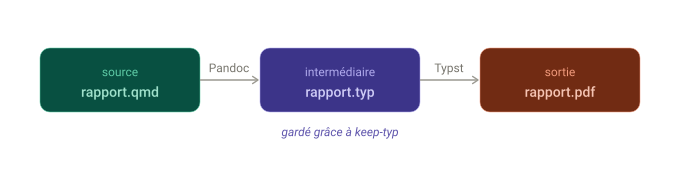
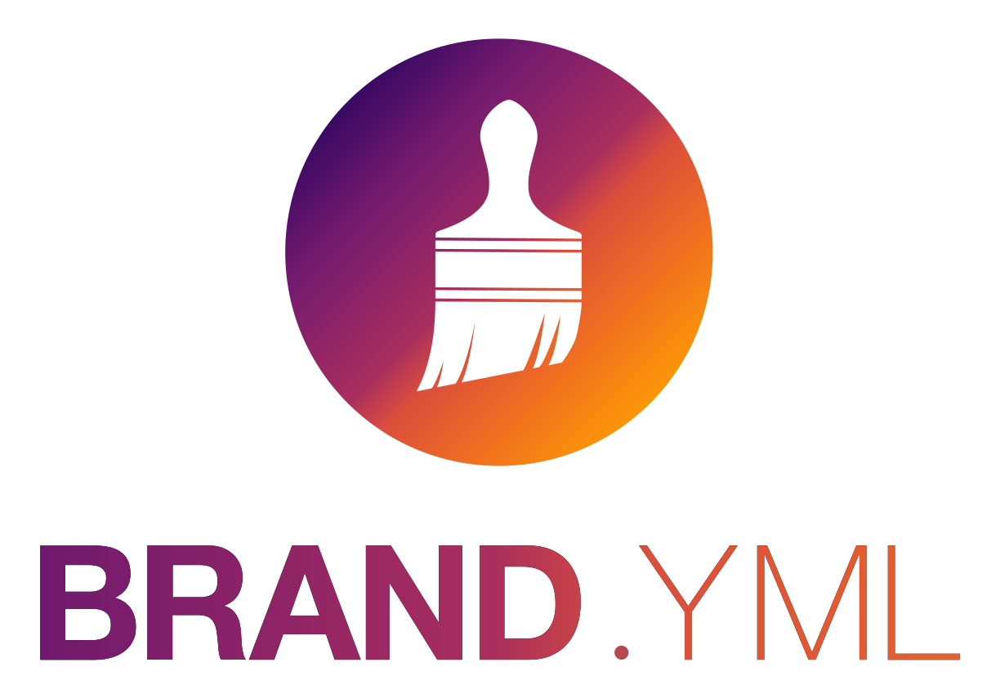
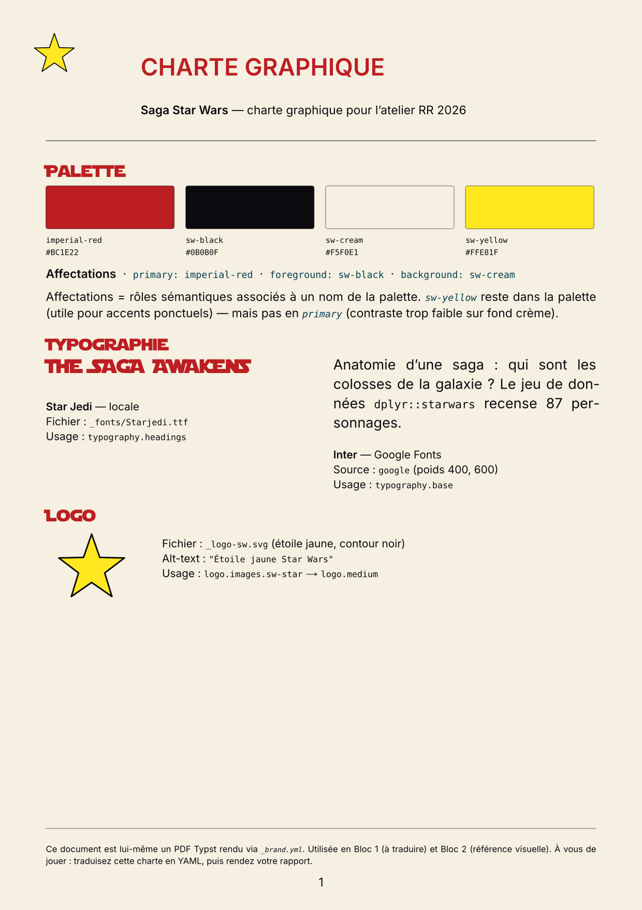

## Le rythme du tutoriel

::::::::: columns
:::: {.column width="33%"}
::: {.callout-note appearance="minimal"}
## My turn

Quelques slides pour poser les concepts clés.
:::
::::

:::: {.column width="33%"}
::: {.callout-tip appearance="minimal"}
## Our turn

Démo live — vous suivez dans votre éditeur.
:::
::::

:::: {.column width="33%"}
::: {.callout-warning appearance="minimal"}
## Your turn

Exercice en autonomie avec chronomètre.
:::
::::
:::::::::

::: notes
Expliquer le rythme dès le début. Chaque bloc suit ce cycle. L'idée c'est de passer un maximum de temps les mains dans le code, pas à regarder des slides.
:::

## C'est quoi Typst ?

[Typst](https://typst.app/) joue le même rôle que LaTeX : produire un PDF. Avec Quarto, vous restez côté Markdown — la traduction vers Typst est automatique.

::: {.fragment}
Ce que **vous écrivez** (Markdown) :

``` markdown
# Mon rapport

Un mot **en gras**
et un [lien](https://example.org).
```
:::

::: {.fragment}
Ce que **Quarto génère** (Typst) :

``` typ
= Mon rapport

Un mot #strong[en gras]
et un #link("https://example.org")[lien].
```
:::

::: notes
Slide visuelle : le but n'est pas d'enseigner Typst, c'est de rassurer. "Tu écris du Markdown, t'as pas besoin d'apprendre Typst pour démarrer." Le snippet Typst montre la traduction concrète — `=` pour le titre, `#strong[...]` pour le gras, `#link(...)[...]` pour les liens.

Contrat oral : on ouvrira ensemble le `.typ` 2 slides plus loin (`keep-typ: true`) — pas une option facultative. Le participant est prévenu, pas de surprise à l'Exo 1 étape 3.

On y jettera un œil ensemble avec `keep-typ: true` — juste pour démystifier.
:::

## `format: typst` — un PDF sans LaTeX

Vous avez un document Quarto et vous voulez un PDF ?

``` {.yaml filename="rapport.qmd"}
---
title: "Mon rapport"
format: typst
---
```

::: incremental
- **Rien à installer** — Typst est intégré à Quarto depuis la version 1.5
- **Rapide** — compilation en quelques secondes, pas plusieurs minutes
- **Erreurs lisibles** — fini les messages LaTeX cryptiques
- **Léger** — pas de distribution TeX de 1 Go à gérer
:::

::: notes
Le point d'entrée : une seule ligne de YAML. Pas besoin de convaincre les gens que LaTeX est mauvais — montrer directement que Typst est simple.
:::

## Les options de formats

``` {.yaml filename="rapport.qmd" code-line-numbers="3-5"}
---
format:
  typst:
    toc: true
    papersize: a4
    margin:
      x: 2.5cm
      y: 2.5cm
---
```

::: {.fragment .fade-in}
D'autres options existent (`mainfont`, `number-sections`, `linestretch`...) — on les verra en démo.
:::

::: notes
Ne pas tout montrer ici. Juste papersize et margin pour que les gens voient la structure YAML. Le reste sera manipulé en live.
:::

## `keep-typ: true` — comprendre les coulisses

{width="100%"}


## `keep-typ: true` — comprendre les coulisses

::: {.fragment .fade-in}
``` {.yaml filename="rapport.qmd" code-line-numbers="4"}
---
format:
  typst:
    keep-typ: true
---
```
:::

::: {.fragment .fade-in}
Le fichier `.typ` intermédiaire vous permet de :

- Comprendre ce que Quarto génère pour Typst
- Déboguer un rendu inattendu
- Apprendre la syntaxe Typst progressivement
:::

::: notes
Moment pédagogique clé. Le pipeline démystifie la magie : Quarto n'est pas une boîte noire, on peut voir ce qui se passe entre le .qmd et le .pdf.
:::

## `_brand.yml` — un doc stylé en un fichier {.smaller}

Un seul fichier YAML pour définir l'identité visuelle de vos documents :

::::::: columns
::: {.column width="45%"}
``` {.yaml filename="_brand.yml"}
color:
  primary: "#1a5276"
  secondary: "#f39c12"
typography:
  fonts:
    - family: "Noto Sans"
      source: google
  base: "Noto Sans"
```
:::

::: {.column width="5%"}
:::

:::: {.column width="45%"}
::: incremental
- Placez `_brand.yml` à côté de votre `.qmd`
- Quarto l'applique **automatiquement**
- Couleurs, polices, logo...
- Fonctionne avec HTML, Typst, RevealJS...
:::
::::
:::::::

::: center
{width="20%"} <https://posit-dev.github.io/brand-yml/>
:::

::: notes
C'est le deuxième moment fort : on passe d'un PDF basique à un PDF aux couleurs de son organisation. Rappeler que \_brand.yml a été présenté aux RR 2025 pour ceux qui l'ont vu.

**Mention orale \~30 sec pendant la démo Our turn** : le `_brand.yml` ne pilote pas que le PDF. Le package R `brand.yml` fournit des helpers `theme_brand_ggplot2()` et `theme_brand_gt()` qui appliquent la même charte aux figures et tableaux. Visible dans `correction/rapport-starwars.qmd`. On en parle pas plus, c'est dans les Ressources.

Parler des helpers R `theme_brand_*()`.

**Si quelqu'un demande sur le placement du logo** (« il est en haut à gauche, je peux le mettre ailleurs ? ») : le placement par défaut en `format: typst` est `page(background)` haut-gauche, taille 1.5in et padding 0.75in — assez gros pour chevaucher les titres de page 2+ ! Personnalisation via `format.typst.logo: { path, location, width, padding }` directement dans le YAML doc (Bloc 1) ou dans `_quarto.yml` (Bloc 2). La correction utilise `width: 0.6in` + `padding: 0.4in` pour tenir dans la marge top de 2.5cm. Options `header`/`footer` placement encore en discussion côté Quarto upstream — voir la [discussion #13591](https://github.com/orgs/quarto-dev/discussions/13591).
:::

## Voici la charte {.smaller}

:::::: columns
::: {.column width="55%"}
{fig-alt="Page A4 de la charte graphique Star Wars : logo étoile jaune en haut-gauche, titre 'CHARTE GRAPHIQUE' en rouge impérial gras, sous-titre Saga Star Wars, 4 swatches de palette (rouge impérial, noir SW, crème, jaune SW) avec hex codes, sections Typographie (Star Jedi locale, Inter Google) et Logo, footer méta."}
:::

::: {.column width="45%"}
::: incremental
- Une **vraie charte** à transcrire
- Palette nommée + affectations (`primary`, `foreground`, `background`)
- Polices: Inter (Google) + Star Jedi (locale)
- Ce PDF est lui-même rendu par Quarto + Typst + `_brand.yml` — vous allez faire pareil
:::
:::
::::::

::: notes
Slide-pont entre le concept générique (`_brand.yml`) et la démo concrète. Le PDF est dans le starter de l'exercice — chaque apprenant·e l'ouvre côté lecteur PDF. **Côté Our turn et Your turn** : projeter `_charte/charte-starwars.pdf` à l'écran (ou via `1-quarto-typst/charte-starwars.png` si plus rapide) pour que l'apprenant·e voie cible et transcription en parallèle.

Méta-cohérence pédagogique à expliciter à l'oral : « ce PDF que vous tenez n'est pas qu'une spec, c'est un exemple rendu — son logo, ses titres en Star Jedi, sa palette viennent d'un `_brand.yml` identique à celui que vous allez écrire ».

Le terme « affectations » dans nos supports correspond aux « assignments » de la charte (terme anglais conservé dans la spec `_brand.yml`) = mapping `primary` / `foreground` / `background` → noms de palette. Le préciser oralement (la charte n'a pas la place de l'expliquer).
:::

## Faisons ensemble !

::: callout-tip
## Faisons ensemble !

On passe le doc en PDF Typst, puis on lui applique une couleur via `_brand.yml`.

1.  Ouvrez `rapport-starwars.qmd`, passez `format: html` → `format: typst`, rendez → PDF brut
2.  Créez `_brand.yml` avec **une seule couleur** + assignation `primary`, re-rendez → titres et liens colorés

→ À vous ensuite pour la charte complète (palette + affectations + polices).
:::

::: notes
C'est la démo live, **format ultra-court** : 5-6 minutes max. Pas-à-pas détaillé (snippets prêts à copier, ressources à ouvrir, pièges anticipés) dans `_speaker/demo-bloc1-our-turn.qmd`.

**Pourquoi minimal** : Our turn montre l'effet d'une édition YAML sur le PDF rendu (une couleur suffit), Your turn transcrit la charte SW complète. Si Our turn fait tout, Your turn = répétition.

**Avant la démo** : projeter `_charte/charte-starwars.pdf` à côté de l'éditeur — apprenant·e voit cible (charte) pendant qu'on prend une seule couleur en exemple.

**Snippet à coller en étape 2** (charge mentale zéro pendant la démo) :
```yaml
color:
  palette:
    imperial-red: "#BC1E22"
  primary: imperial-red
```

**Transition vers Your turn** : « vous avez vu la boucle, à vous avec la charte complète — 4 couleurs au lieu d'1, affectations `foreground` + `background`, Google sur le corps, Star Jedi sur les titres. 12 min. »
:::

## Exercice 1 {.wide-list}

::: callout-warning
## À vous !

🎯 Transformer un `.qmd` HTML en PDF Typst stylé via `_brand.yml`.

📄 **Charte fournie** : `charte-starwars.pdf` dans le starter (palette + polices + logo + affectations).

⏱ **12 minutes** — page boussole projetée à côté.

📖 Consigne complète : [Page Exercice 1](index.qmd)
:::

::: notes
12 minutes. Ouvrir la page boussole `1-quarto-typst/boussole.html` dans un onglet à projeter à côté (countdown autonome). Passer dans les rangs pour aider les bloqué·e·s.

Les problèmes fréquents : oubli des guillemets sur les couleurs hex dans brand.yml, nom de police Google mal orthographié, indentation YAML, et **espacement parasite des chiffres dans le tableau gt** (bug `gt → Typst` côté Windows/macOS, workaround `gt::opt_table_font("Inter")` visible dans la correction).

**Étape 4 (Star Jedi)** : pour les participants bloqués sur la syntaxe `source: file` + `files:`, montrer rapidement le bloc dans `correction/_brand.yml` au tableau. Ne pas paniquer si certains zappent l'étape — le rendu reste correct sans (titres en police Google par défaut). C'est l'étape la plus « visuelle » de l'exo : tous les titres de section passent en lettres décoratives Star Jedi, effet immédiat.

**Indication pour les participants qui finissent vite** : leur dire « ouvrez `correction/rapport-starwars.qmd` et regardez les 3 derniers blocs `tab_style()` du tableau gt — les couleurs viennent de votre `_brand.yml` via `brand_color_pluck()` ». Ancre le message de la pépite "Une charte, partout" sur du code concret.
:::

## Saviez-vous que...

::: callout-note
## Saviez-vous que...

- **Blocs raw Typst** — Besoin de Typst natif ? Utilisez ```` ```{=typst} ```` pour injecter du code Typst directement dans votre `.qmd`
- **Vos tableaux fonctionnent** — Les tableaux `gt` (R) et `Great Tables` (Python) avec du CSS sont traduits automatiquement en Typst par Quarto
- **Une charte, partout** — Lisez `_brand.yml` depuis R via `brand_color_pluck(brand, "ma_couleur")` : les couleurs de votre PDF, de vos graphes `ggplot` et de vos tableaux `gt` viennent du même fichier
- **PDF accessible en une ligne** — Ajoutez `pdf-standard: ua-1` dans le YAML pour un PDF conforme au standard d'accessibilité PDF/UA-1
:::

::: {.fragment .fade-in}
 Plus de détails sur la page [Ressources](../4-ressources.qmd)
:::

::: notes
Slide rapide, 2-3 minutes max. L'objectif est juste de planter des graines. Les gens curieux iront voir la page Ressources. Cette slide est le premier fusible à couper si on manque de temps.
:::